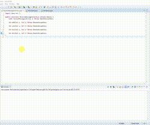

# Calculadora com RMI

## Como rodar a aplicação 

> ECLIPSE
- Clica com o botão direito no RmiServer
  - Clica em Run As >> Java Application
- Clica com o botão direito no RmiClient
  - Clica em Run As >> Run Configurations 
    - Siga para a aba Arguments e adicione: serverAddress, port e uma palavra (como exemplo, Olá). 
    - Para rodar aperte Run.
- Ir para o console do RmiClient para digitar os números e a operação.

> NETBEANS
- Clica com o botão direito no RmiServer
  - Clica en Run Maven
- Clica com o botão direito no projeto
  - Clica em Set Configuration >> Customize >> Run
    - Em Arguments adiciona: serverAddress, port e uma palavra (como exemplo, Olá). 
- Clica com botão direito no RmiClient >> Run

